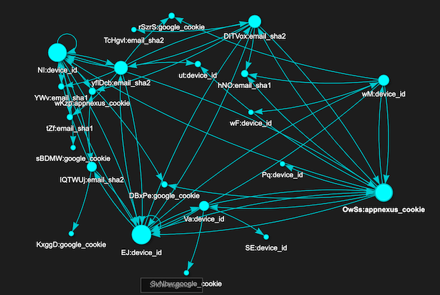

# astradb-janusgraph-demo

## Introduction
This is a demo app which showcases 
- connecting JanusGraph setup to DataStax AstraDB as the backend 
- Setting up the Schema and Loading test data into JanusGraph
- Sample queries via gremlin-console 

- The demo app uses simulates the Identity Resolution use case which is the process of matching identifiers across devices and touchpoints to a single profile which helps build a cohesive, omnichannel view of a consumer, enabling brands to deliver relevant messaging throughout the customer journey
- The underlying data source for IDR is generally an Identity Graph (IDG) which is a profile database housing all known identifiers correlated to individuals. The IDG also stores the metadata about the identifiers
- An IDG as below for a single user who is represented **_via multiple identifiers all connected to each other directly or transitively_**
  

## How to run
- **Build the codebase**
  ```
  ./gradlew shadow
  ```
- **Run the Loader**
  - The loader sets up graph schema and then loads the data
    ```
    java -jar build/libs/astradb-janusgraph-demo-app-1.0-SNAPSHOT-all.jar <path-to-executorConf.json>
    ```
- **Interacting with the graph**
  - We have collated queries in `resources/queries.txt` for playing with the demo data loaded via gremlin-console

## License

Copyright 2021 DataStax Inc

Licensed under the Apache License, Version 2.0 (the "License");
you may not use this file except in compliance with the License.
You may obtain a copy of the License at

     http://www.apache.org/licenses/LICENSE-2.0

Unless required by applicable law or agreed to in writing, software
distributed under the License is distributed on an "AS IS" BASIS,
WITHOUT WARRANTIES OR CONDITIONS OF ANY KIND, either express or implied.
See the License for the specific language governing permissions and
limitations under the License.

